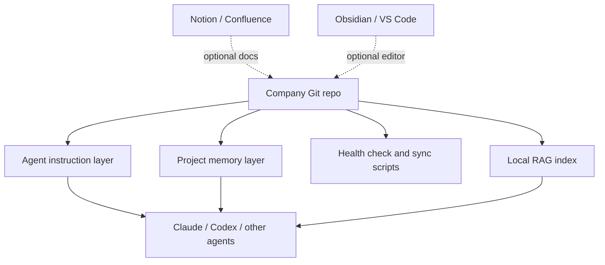

# Architecture

## Decision

AgentOS Vault uses Git as the source of truth.

Obsidian, Notion, Confluence, Google Drive, and SharePoint are interfaces or
external sources. They are not the core operating layer.

## Why

Agents need context that is:

- predictable
- local or cheaply retrievable
- versioned
- reviewable
- portable across machines
- easy to diff
- easy to roll back

Plain text in Git satisfies those constraints better than a SaaS workspace as
the primary runtime.

## Layers

## Core Files

| File | Purpose |
| --- | --- |
| `AGENTS.md` | Vendor-neutral agent instructions |
| `CLAUDE.md` | Claude Code compatibility |
| `docs/ai/PRIMER.md` | Compact operating system |
| `projetos/<x>/_hot.md` | Fresh context, rewritten by agents |
| `projetos/<x>/CONTEXT.md` | Invariants and canonical paths |
| `projetos/<x>/_status.md` | Append-only history |
| `config/agentos.yaml` | Mutable install configuration |
| `scripts/vault_health_check.py` | Operational diagnostics |
| `scripts/vault_rag.py` | Local lexical context retrieval |
| `scripts/vault_sync.py` | Pull, check, commit, push wrapper |

## Token Economy

The system avoids loading complete history on every session.

Daily retrieval path:

1. short global rules
2. compact primer
3. active project hot state
4. stable project context
5. evidence pack only when needed

Full history remains available but is not the default prompt payload.

## Enterprise Expansion Points

- SSO and permissions through the Git provider
- CI checks through GitHub Actions or GitLab CI
- semantic RAG through Postgres/pgvector
- executive portal through Notion or Confluence
- logs and tracing through a company observability stack

